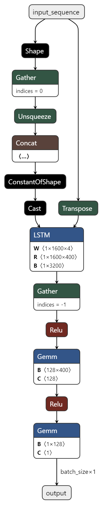
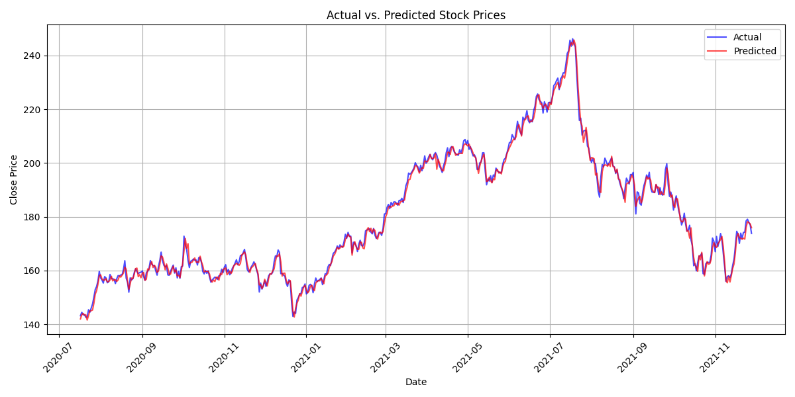
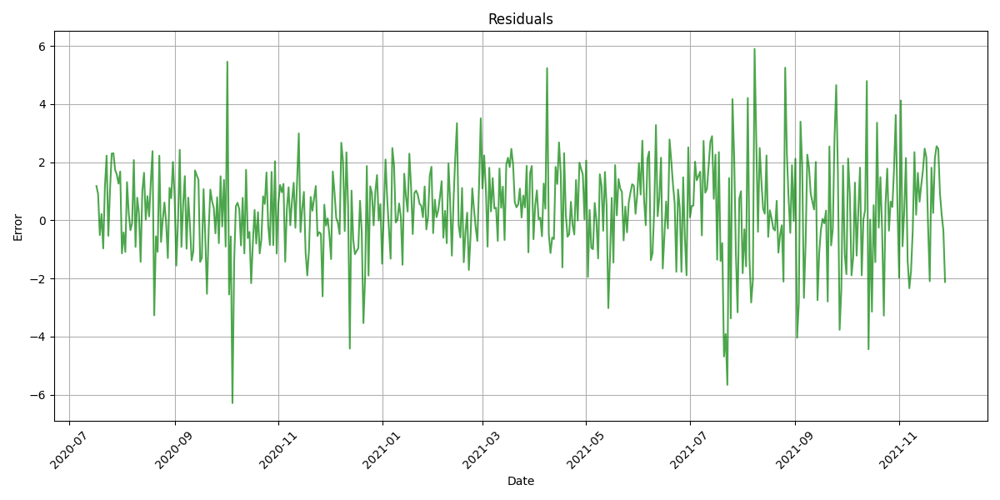

# Stock Price Predictor

## Description

This project aimed to develop an LSTM (Long Short-Term Memory) model 
capable of predicting the closing price of a stock based on historical 
data. The model is trained on time series data and utilizes the power of 
LSTMs to capture long-term dependencies and patterns in stock price 
movements.

## Documentation

### Data preprocessing
A total of 4,097,462 examples of stock data were collected to train the model. 
The features included the opening stock price, high, low, and volume, while the 
target was the closing price of the stock. The features were normalized using 
Scikit-learn's StandardScaler and the targets were normalized using the MinMaxScaler. 
The data was then split into a training set with 3,687,715 examples and a test set 
with 409,747 examples.

### Model architecture
To accurately predict the stock's closing price, the LSTM (Long Short-Term Memory) model 
was chosen for its efficiency and accuracy. LSTMs are a type of recurrent neural network 
(RNN) that can learn and remember long-term dependencies in sequential data, such as 
time series or natural language. Unlike traditional RNNs, which suffer from the 
vanishing gradient problem, LSTMs use a gating mechanism to control the flow of 
information, allowing them to selectively remember or forget information from previous 
time steps. This is crucial for stock price prediction as the LSTM can use historic
information from previous dates to make highly accurate predictions.

The model was created with PyTorch, which was chosen for its ability to easily train on
GPUs and flexibility. To create the LSTM, a singular LSTM layer is initialized with 400
hidden units, two fully connected layers, and a ReLU activation function. The input 
features are first run through the LSTM layer, then the ReLU activation is applied to
the output. That output is then processed by a fully connected layer, a ReLU acitvation
is then applied to the output of the first fully connected layer, then the output is
processed by the last fully connected layer, which is the model's final output. Adam 
was chosen for the optimizer and Mean Squared Error was chosen for the loss.

### Evaluation
The model was evaluated using Mean Squared Error (MSE), with which it achieved a fantastic
score of 4.4191e-08. To further visualize the model's performance, the model's predictions
were plotted against the target value.

As shown in the graph, the predicted values closely follow the actual values. The percentage
error can also be plotted, in which the model was never more than 6% inaccurate.

## License

This project is licensed under the MIT License - see the 
[LICENSE](LICENSE) file for details.
